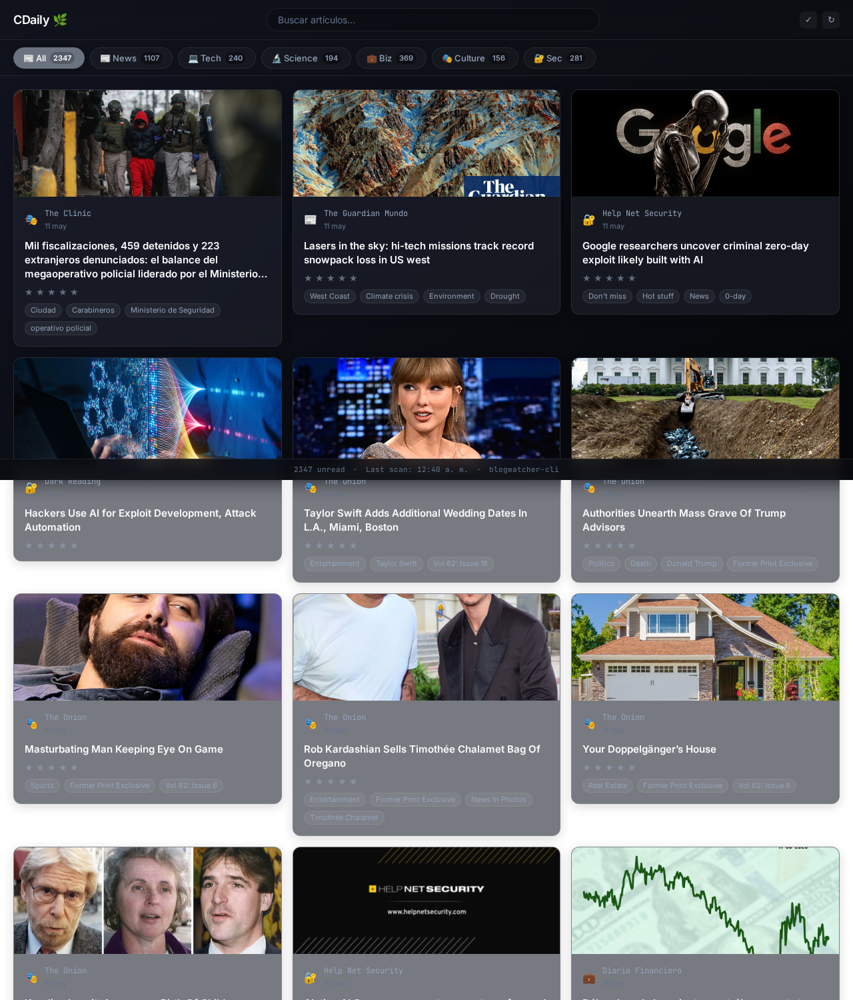

# CDaily — Personal Daily Feed

Todos tus agentes están corriendo. Tus cron jobs disparan, tus scripts scrapean, tus modelos infieren. ¿Qué haces ahora que no te distraiga tanto pero sea casi tocar pasto?

CDaily es un poco eso. Un feed reader minimalista que abres en una pestaña y hojeas entre tasks. Lee directo del SQLite de blogwatcher-cli, sin duplicar datos. Sin notificaciones. Sin scroll infinito. Solo una cuadrícula de lo que está pasando afuera mientras tú estás adentro.



## Qué hace

- Lista artículos desde la base de `blogwatcher-cli`
- Filtra por categoría y búsqueda de texto
- Marca leído / no leído
- Marca favoritos / para leer después
- Guarda ratings 1–5 para reordenar el feed
- Genera resúmenes IA bajo demanda
- Extrae y cachea imágenes OG cuando existen

## Requisitos

- Python 3.11+
- `blogwatcher-cli` instalado
- `blogwatcher-cli.db` en `~/.blogwatcher-cli/`
- SQLite con el schema requerido por blogwatcher-cli

## Quick start local

```bash
cd cdaily
python -m pip install -r requirements.txt
python -m cdaily.main
# abrir http://localhost:7890
```

## Configuración

El archivo tracked `config.yaml` usa categorías genéricas y defaults seguros. Para overrides locales, usa variables de entorno o un archivo local ignorado por git.

Variables útiles:

- `CDAILY_CONFIG` — ruta a un YAML alternativo
- `CDAILY_DB_PATH` — override del path a la DB
- `CDAILY_AI_ENDPOINT` — endpoint OpenAI-compatible para resúmenes
- `CDAILY_AI_API_KEY` — API key opcional para el endpoint de IA

Ejemplo rápido:

```bash
export CDAILY_AI_ENDPOINT="http://localhost:12345/v1/chat/completions"
export CDAILY_AI_API_KEY="tu_key_si_aplica"
```

También puedes copiar `.env.example` a `.env` o `config.yaml.example` a `config.yaml` si prefieres empezar desde los defaults públicos. `.env`, `.env.local` y `config.local.yaml` están ignorados por git.

## Docker

```bash
docker compose up --build
# App disponible en http://localhost:7890
```

Si usas Docker con un endpoint IA que vive en tu host, el `docker-compose.yml` ya deja `CDAILY_AI_ENDPOINT` apuntando a `host.docker.internal`.

## Desarrollo

### Lint y formato

```bash
python -m black cdaily tests
python -m flake8 cdaily tests
```

### Tests

```bash
pytest tests/ -v
```

## Arquitectura

- `cdaily/main.py` — bootstrap mínimo de FastAPI
- `cdaily/routes/` — capa HTTP
- `cdaily/services/` — scraping, resúmenes, scan y caché de imágenes
- `cdaily/repositories/` — acceso a SQLite y queries
- `cdaily/database.py` — shim de compatibilidad para imports antiguos
- `cdaily/static/` — JS y CSS del frontend
- `cdaily/templates/` — HTML base

## Agregar o quitar blogs

```bash
# Agregar
blogwatcher-cli add "Nombre" https://example.com --feed-url https://example.com/feed.xml

# Quitar
blogwatcher-cli remove "Nombre" --yes
```

Los cambios se reflejan en CDaily al siguiente refresh automático o manual.

## Open source

CDaily is released under the [MIT License](LICENSE). See [CONTRIBUTING.md](CONTRIBUTING.md) for development setup and pull request guidelines.

## Notas de publicación pública

- No hay secretos hardcodeados en el repo.
- Las credenciales de IA van por variables de entorno, nunca dentro de `config.yaml`.
- Todas las URLs externas se validan (solo http/https, sin IPs privadas).
- Archivos locales sensibles o personalizados se ignoran con `.gitignore`:
  - `.env`
  - `.env.local`
  - `config.local.yaml`
  - `.venv/`

## Autenticación opcional (producción)

Para exponer CDaily en red o internet, activa auth token vía entorno:

```bash
export CDAILY_API_TOKEN="<tu-token-seguro>"
```

Una vez seteado, toda request a `/api/*` requiere header:

```
Authorization: Bearer <tu-token-seguro>
```

La página principal (`GET /`) y archivos estáticos quedan abiertos.

Si no seteas `CDAILY_API_TOKEN`, la autenticación está desactivada y todo
funciona como antes — ideal para desarrollo local.

## HTTPS con reverse proxy (producción)

CDaily sirve HTTP en `127.0.0.1:7890`. Para producción, ponlo detrás de un
reverse proxy con TLS. El más simple es Caddy:

```bash
# Caddyfile
midominio.com {
    reverse_proxy 127.0.0.1:7890
}
```

```bash
caddy run
```

O con nginx:

```nginx
# /etc/nginx/sites-available/cdaily
server {
    listen 443 ssl;
    server_name midominio.com;
    ssl_certificate     /etc/ssl/certs/midomio.pem;
    ssl_certificate_key /etc/ssl/private/midomio.key;

    location / {
        proxy_pass http://127.0.0.1:7890;
        proxy_set_header Host $host;
        proxy_set_header X-Real-IP $remote_addr;
    }
}
```

## Troubleshooting

### La base de datos no existe

- Verifica que `~/.blogwatcher-cli/blogwatcher-cli.db` exista
- Revisa permisos: `ls -la ~/.blogwatcher-cli/blogwatcher-cli.db`

### Faltan columnas en articles

- Verifica el schema de blogwatcher-cli
- Revisa: `sqlite3 ~/.blogwatcher-cli/blogwatcher-cli.db ".schema articles"`

### El endpoint IA no responde

- Revisa `CDAILY_AI_ENDPOINT`
- Si usas Docker, asegúrate de que el endpoint sea alcanzable desde el contenedor

### El puerto ya está ocupado

- Revisa si algo usa el 7890: `lsof -i :7890`
- Cambia el puerto en `config.yaml` o en tu override local
